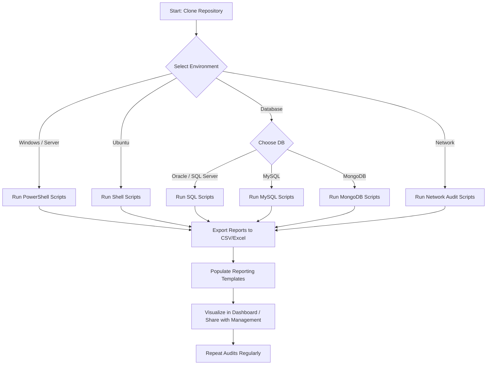

# Cybersecurity Champion Starter Toolkit

 
 


### **Technologies / Tools Covered**

  
  
  
  
  
  
  
  

---

## **Overview**
The **Cybersecurity Starter Toolkit** is designed for system administrators stepping into a cybersecurity leadership role. It provides **ready-to-use scripts, templates, and dashboards** for auditing, monitoring, and hardening:

- **Windows & Windows Server** – AD audits, local admins, password policies, server hardening  
- **Ubuntu Linux** – system audit, patch checks, sudoers audit  
- **Databases** – Oracle, SQL Server, MySQL, MongoDB user & privilege audits, backup verification  
- **Network Security** – firewall, switches, access points, CCTV cameras  

**Key Goals:**
- Improve **visibility** into accounts, privileges, network devices, and patch status  
- Promote **security hygiene** in day-to-day IT operations  
- Enable **automated reporting** for management  

---

## **Workflow Diagram**



> Workflow: choose environment → run scripts → export reports → populate templates → visualize → repeat.

---

## **Folder Structure**

```
Cybersecurity_Champion_Toolkit/
│
├── windows-scripts/       # PowerShell scripts for AD, local admins, server hardening
├── ubuntu-scripts/        # Linux system audit & patch scripts
├── database-scripts/      # Oracle, SQL Server, MySQL, MongoDB scripts
├── network-scripts/       # Firewall, switch, AP, CCTV audit scripts
├── report-templates/      # Excel & CSV templates for dashboards
├── README.md
├── instructions.txt
└── LICENSE
```

---

## **Getting Started**

### **1. Clone the Repository**

```bash
git clone https://github.com/crispusomollo/CyberSecurity-Starter-ToolKit.git
cd Cybersecurity_Starter_Toolkit
```

### **2. Windows & Windows Server Scripts**

* Open PowerShell as Administrator
* Navigate to `windows-scripts/` and run scripts:

```powershell
.\domain_user_audit.ps1
.\server_hardening.ps1
```

* Reports saved in `C:\Reports`.

### **3. Ubuntu Scripts**

* Make scripts executable:

```bash
chmod +x *.sh
```

* Run scripts:

```bash
./system_audit.sh
./patch_update_check.sh
```

* Reports saved in `~/reports/`.

### **4. Database Scripts**

* **Oracle / SQL Server** – run `.sql` files in your client
* **MySQL** – run `.sql` or `.sh` scripts, check `/var/backups/mysql/` for backup reports
* **MongoDB** – run `.js` scripts using `mongo` shell, check backup paths
* Always **test on non-production environments first**

### **5. Network Security Scripts**

* Run scripts in `network-scripts/` to check:

  * Firewall status
  * Switch ports via SNMP
  * Access points connected devices
  * CCTV camera status & firmware

---

## **Reporting**

* Populate results in `report-templates/audit_report_template.xlsx` or `privileged_accounts_template.csv`
* Visualize dashboards:

  * Patch compliance
  * Privileged account audits
  * Database security
  * Network device audit

---

## **Contributing**

* Fork the repository, add new scripts, templates, or improvements, and submit a Pull Request

---

## **License**

MIT License – see [LICENSE](LICENSE) for details

---

### ✅ **Tips**

* Add screenshots of report outputs for clarity
* Schedule recurring audits with Task Scheduler (Windows) or cron (Linux)
* Expand scripts gradually to include **alerts and automated remediation**

```

