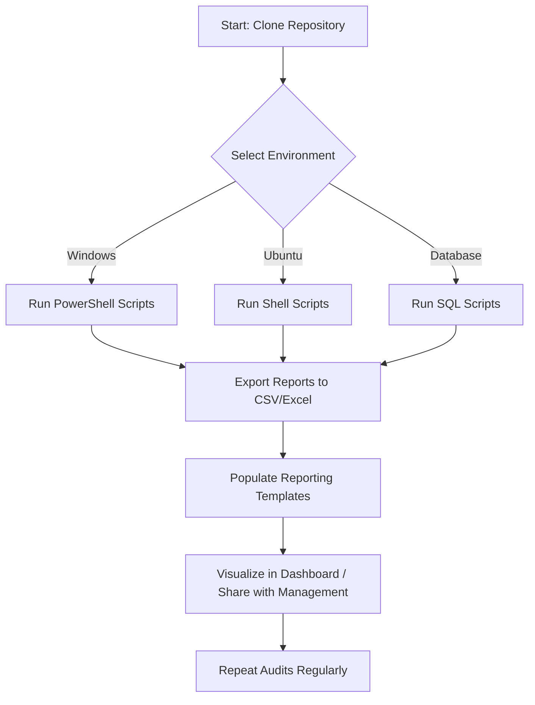

# Cybersecurity Champion Starter Toolkit

 
 


### **Tech / Tools Covered**
  
  
  
  
  

---

## **Overview**
A **starter toolkit for system administrators/enthusiast stepping into the Cybersecurity role**.  
It provides **ready-to-use scripts, templates, and dashboards** to perform audits, enforce security policies, and monitor Windows, Ubuntu, and database environments.  

**Key Goals:**
- Improve **visibility** into accounts, privileges, and patch status  
- Promote **security hygiene** in day-to-day IT operations  
- Enable **automated reporting** for management  

---

## **Workflow Diagram**



> This shows the typical workflow: select environment → run scripts → export reports → visualize & share → repeat audits.

---

## **Folder Structure**

```
Cybersecurity_Starter_Toolkit/
│
├── windows-scripts/
├── ubuntu-scripts/
├── database-scripts/
├── report-templates/
├── README.md
└── instructions.txt
```

---

## **Getting Started**

### **1. Clone the Repository**

```bash
git clone https://github.com/crispusomollo/CyberSecurity-Starter-ToolKit.git
cd Cybersecurity_Starter_Toolkit
```

### **2. Windows Scripts**

* Open PowerShell as Administrator.
* Navigate to `windows-scripts/` and run scripts:

```powershell
.\domain_user_audit.ps1
```

* Reports saved in `C:\Reports`.

### **3. Ubuntu Scripts**

* Make scripts executable:

```bash
chmod +x *.sh
```

* Run scripts:

```bash
./system_audit.sh
```

* Reports saved in `~/reports/`.

### **4. Database Scripts**

* Run in SQL Developer or SSMS on **test databases first**.
* Export results for reporting.

---

## **Reporting**

* Use `report-templates/audit_report_template.xlsx` or `privileged_accounts_template.csv`
* Dashboard visualization ideas:

  * Patch compliance (Windows/Ubuntu)
  * Privileged account audit
  * Database backup verification

---

## **Contributing**

* Fork the repository, make improvements or add new scripts, and submit a Pull Request.

---

## **License**

MIT License – see [LICENSE](LICENSE) for details.

---

### ✅ **Tips**

* Add screenshots of generated reports for extra clarity.
* Schedule recurring audits using Task Scheduler (Windows) or cron (Linux).
* Expand scripts over time to include alerts and automated remediation.

```
